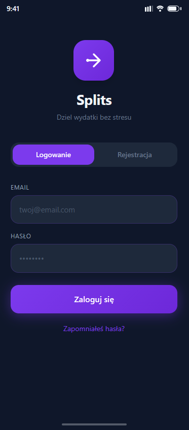
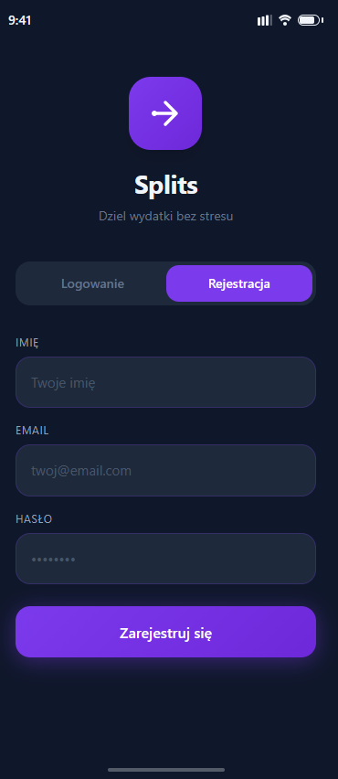
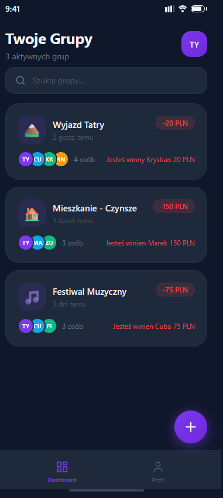
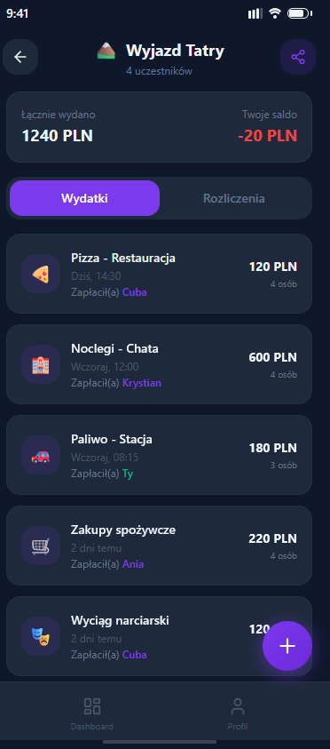
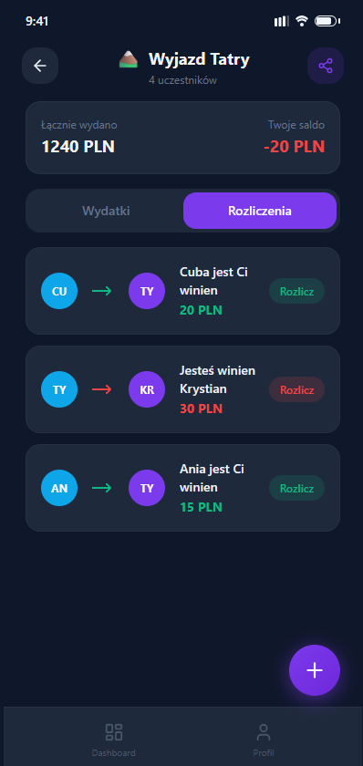
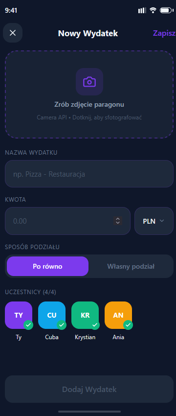

# Projekt Interfejsu i UX (DESIGN.md)

Poniżej znajduje się prezentacja ekranów z interaktywnej makiety aplikacji mobilnej **Splits**. Makieta została przygotowana w celu odwzorowania pełnego przepływu użytkownika (User Flow) oraz zachowania spójności wizualnej (Material Design 3 / Dark Mode).

Wszystkie pliki graficzne znajdują się w dedykowanym folderze `design_screens/`.

---

## Przegląd Ekranów i Przepływu Użytkownika

### 1. Proces Uwierzytelniania
Ekrany startowe odpowiedzialne za rejestrację nowego konta oraz bezpieczne logowanie do systemu zarządzania wydatkami.

| Ekran 01: Logowanie | Ekran 02: Rejestracja |
| :---: | :---: |
|  |  |

---

### 2. Panel Główny i Oś Czasu Wydatków
Główna przestrzeń robocza aplikacji, umożliwiająca podgląd aktywnych grup rozliczeniowych oraz pełną historię dodanych transakcji wraz z datami i kwotami.

| Ekran 03: Dashboard (Lista grup) | Ekran 04: Szczegóły Grupy (Wydatki) |
| :---: | :---: |
|  |  |

---

### 3. Rozliczenia Końcowe i Dodawanie Paragonów
Moduł podsumowujący aktualne bilanse (kto jest komu dłużny) oraz formularz wprowadzania nowej płatności zintegrowany z natywnym Camera API smartfona.

| Ekran 05: Bilanse i Rozliczenia | Ekran 06: Formularz Nowego Wydatku |
| :---: | :---: |
|  |  |

---

## Informacje o Interfejsie
* **Siatka i skalowanie:** Ekrany zaprojektowane w natywnej rozdzielczości smartfona z systemem Android (393x852 px / Android Large).
* **Nawigacja:** Układ wykorzystuje standardowy dolny pasek nawigacyjny (Bottom Navigation Bar) oraz kontekstowe przyciski akcji (Floating Action Button - FAB) ułatwiające obsługę kciukiem.
* **Tryb graficzny:** Pełne wsparcie dla ciemnego motywu (Dark Mode) opartego na palecie Slate (`#0F172A`).
